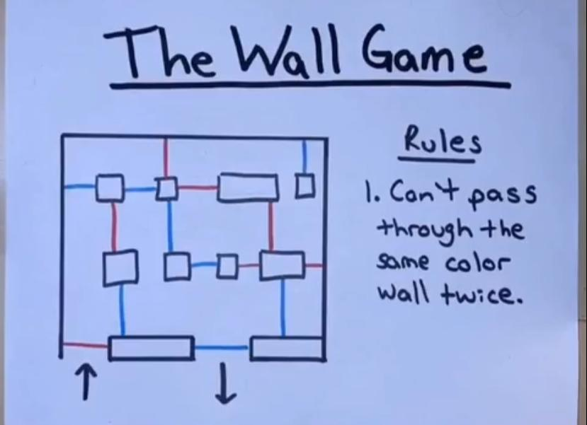
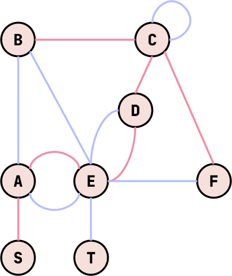

# The Wall Puzzle

The Wall puzzle is a maze-like game where you enter and exit rooms by moving
through colored pathways. You need to alternate between blue and red pathways.
That is if the last pathway you entered was blue, the next one must be red. The
goal is to reach the exit room.

The goal of this repository is to show a generalized solution to the puzzle.

# Example

The puzzle could have multiple rooms and pathways, though the most common
puzzle I've found is below:

# Graph Structure

The puzzle can be represented as a graph where each room is a node and each pathway
is an edge with a color. A graph for the above puzzle might look like:

# Solution

Seeing the puzzle as a graph can help us reason more easily about a solution.
First, since we are trying to find a path from the start to the end, we can use
a graph traversal algorithm to find the path. Dijkstra's algorithm is a good
choice since it can find the shortest path between two nodes and we've used the
[pathfinding](https://docs.rs/pathfinding/latest/pathfinding/) crate before. 

Next, we'll need to determine a neighbor function that we can use to pick
valid neighbors. In the case of this puzzle, a valid neighbor is any room
connected by a pathway of the opposite color of the last pathway we entered.
Therefore, our neighbors function needs to track not only the node but also the
color of the last edge traversed. We'll use a `State` struct to track this
information. 

Finally, we'll need a `success` function to determine if we've reached the end.
This puzzle can calculate this easily as we simply need to check to see if we
are at the end node `T`.
